# Demo Project

## 📌 Overview
Create a CI Pipeline with Jenkinsfile (Freestyle, Pipeline, Multibranch Pipeline)

---

## 🛠 Technologies Used
- Jenkins
- Docker
- Linux
- Git
- Java
- Maven

---

## 📖 Project Description
CI Pipeline for a Java Maven application to build and push to the repository
- Install Build Tools (Maven, Node) in Jenkins
- Make Docker available on Jenkins server
- Create Jenkins credentials for a git repository
- Create different Jenkins job types (Freestyle, Pipeline, Multibranch pipeline) for the Java Maven project with Jenkinsfile to:
  - a.Connect to the application’s git repository
  - b.Build Jar
  - c.Build Docker Image
  - d.Push to private DockerHub repository

---

## 🌐 Live Demo
The Jenkins server is deployed using Yandex Cloud:

http://158.160.170.10:8080/

> ⚠️ Note: The address may be temporarily unavailable if the cloud server is inactive (for example, if the hosting service has not been paid).

Check the feature/jenkins-jobs and other branches 

---

## 📸 Screenshots
Build tools installation
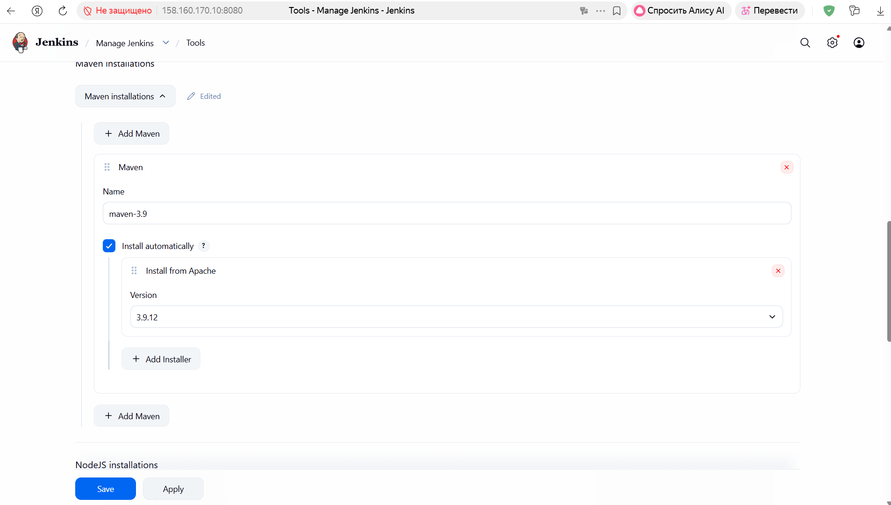
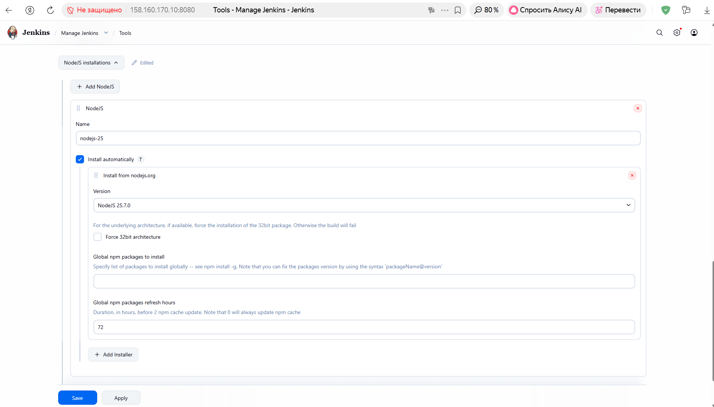

Credentials configuration
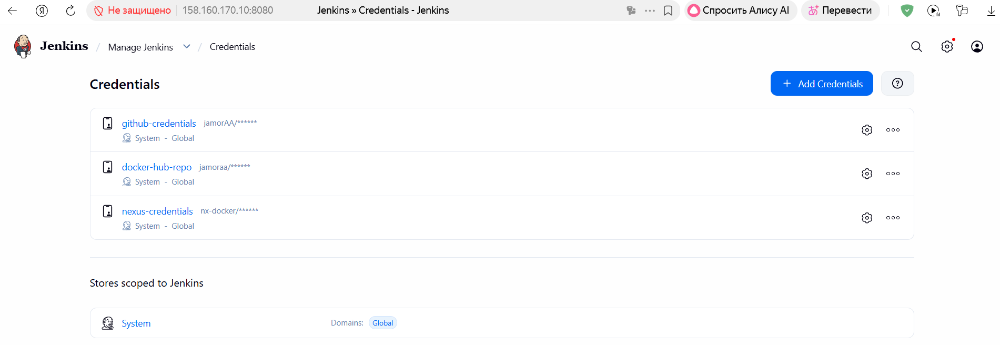

Main page
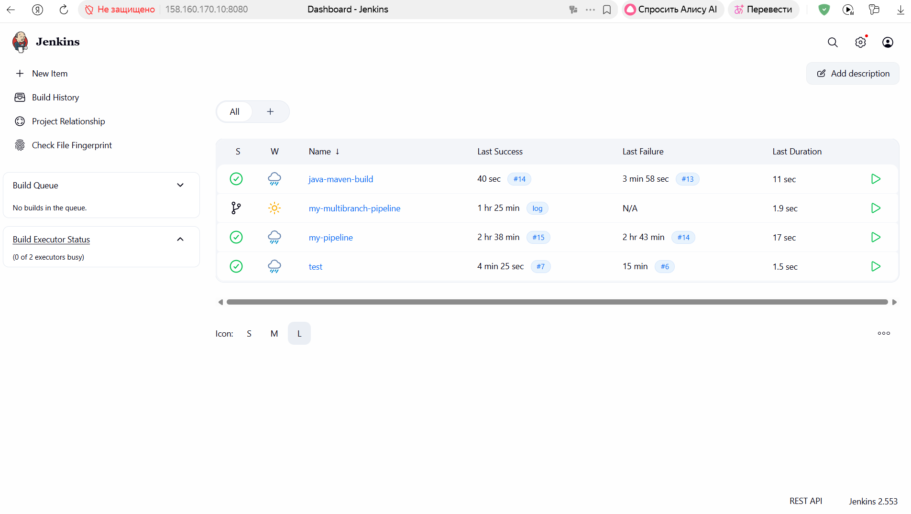

Freestyle job
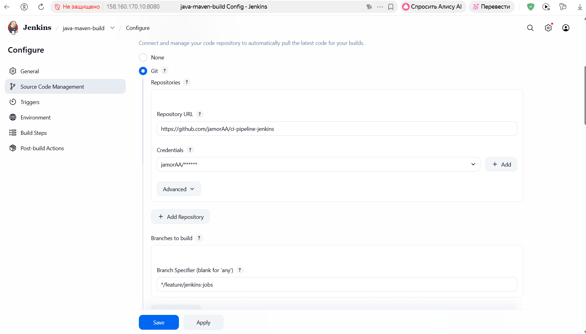
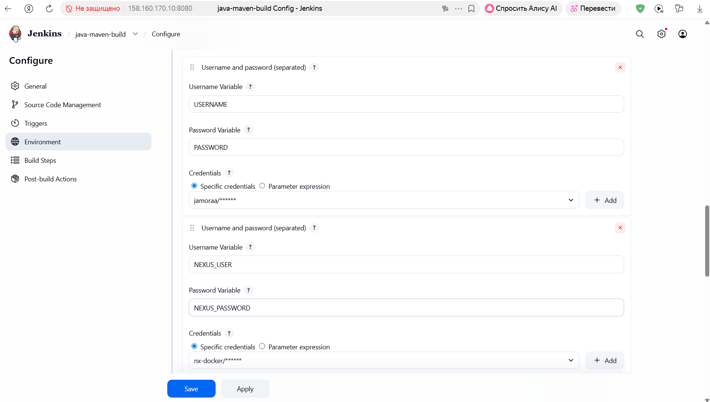
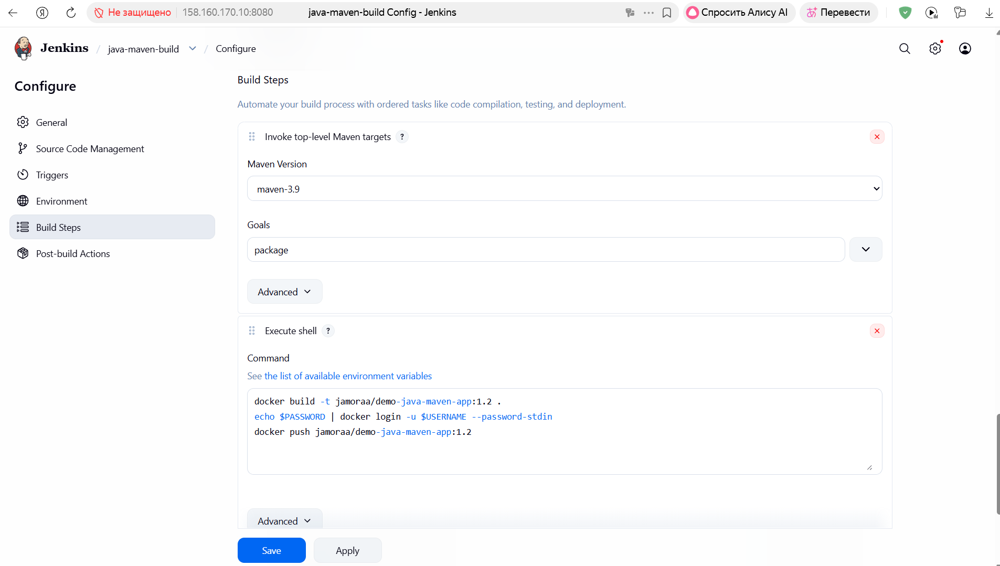

Docker hub
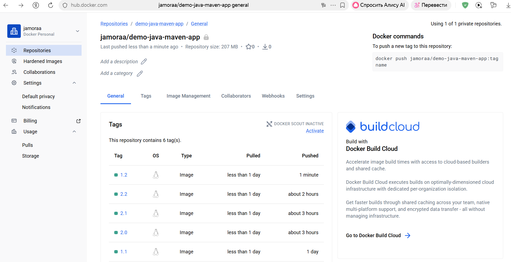

Nexus
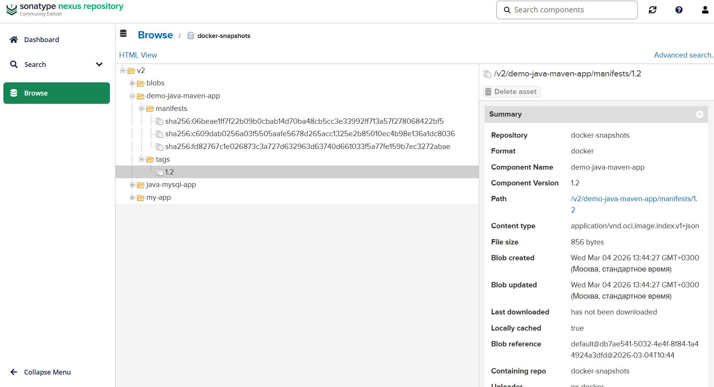

Pipeline
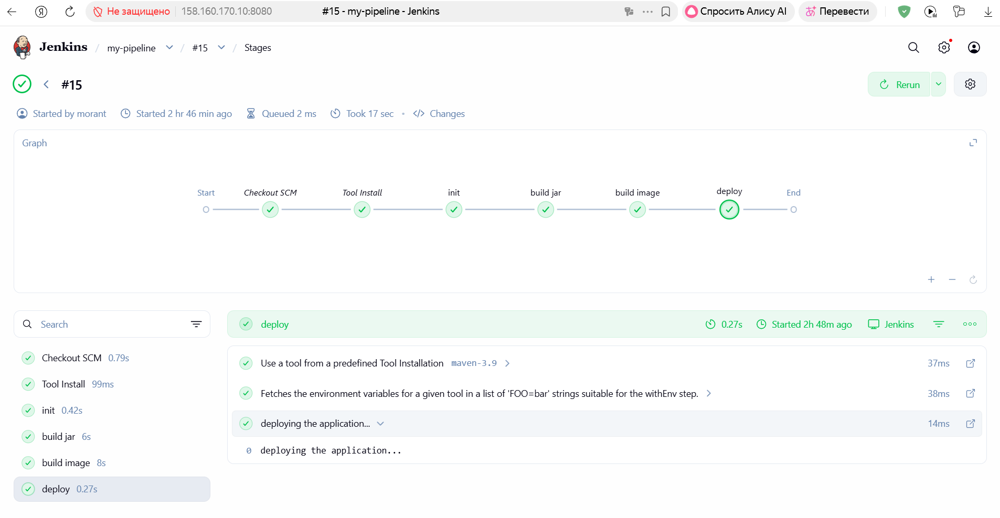

Multibranch Pipeline
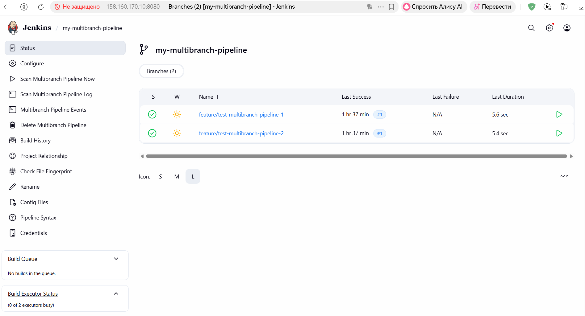
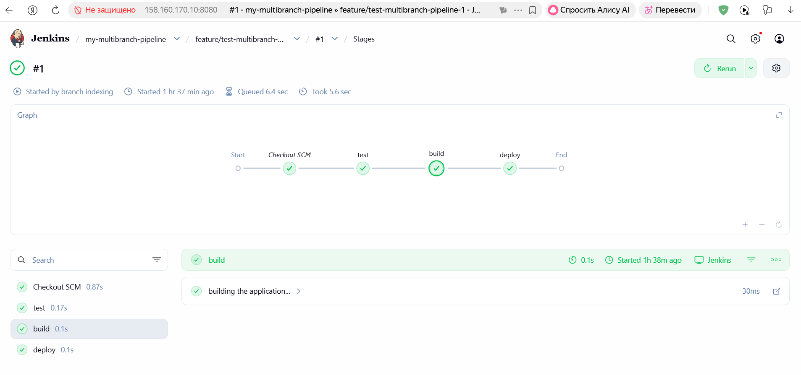
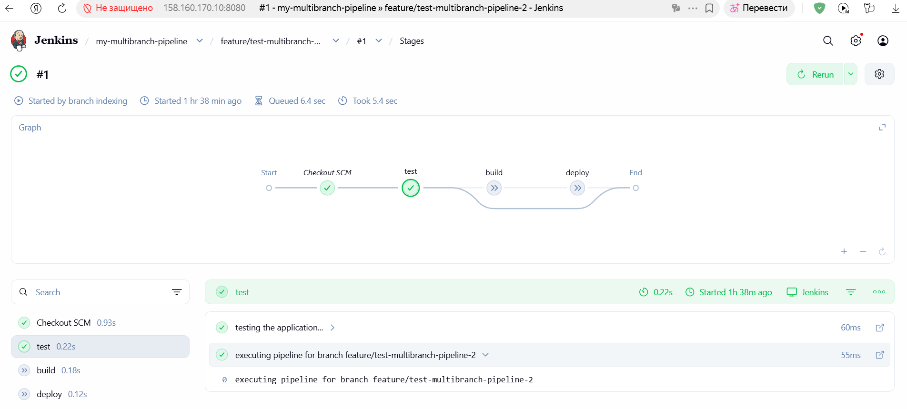

